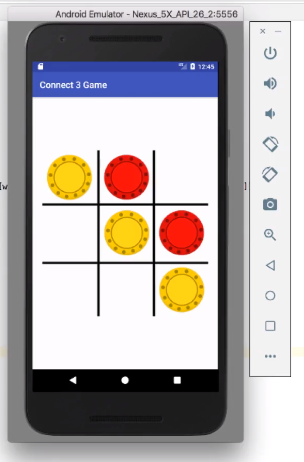

# Connect 3 Game

## Android Studio App using Oreo

* Game for two players, X and O, who take turns marking the spaces in a 3×3 grid. 

* The player who succeeds in placing three of their marks in a horizontal, vertical, or diagonal row wins the game.

*First Chip in*

*Yellow has won*
